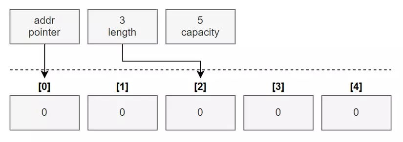
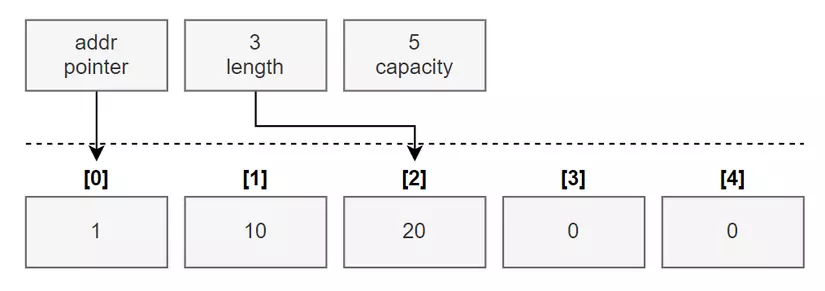
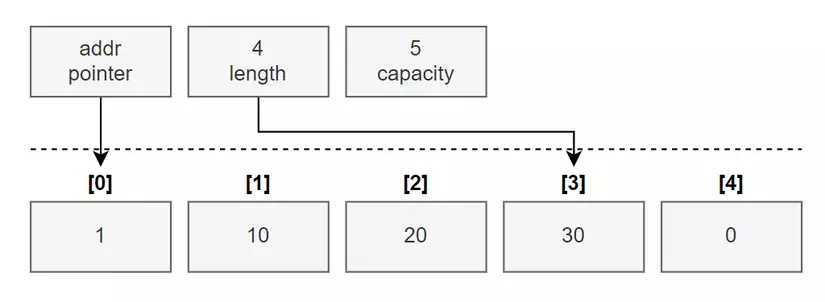
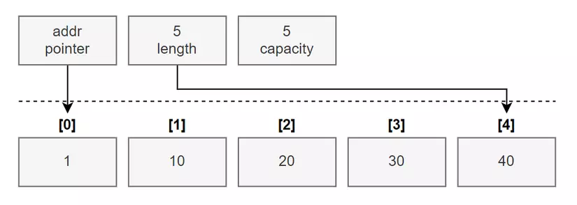
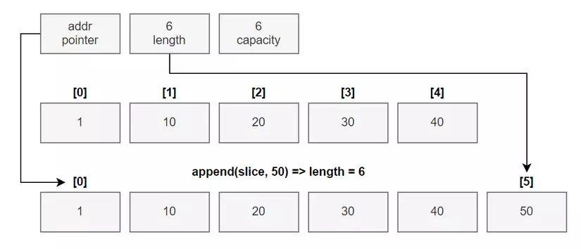

##1. %T\n: Get type of variable 
##2. Declare variable
a. var <name> <type>
b. var <name> = <value>
c. <name> := <value>
##3. GET INPUT FROM USERS:
##4. Array in Golang
```var <name> [lenght]<type>```
Lưu ý: một khi ta khai báo array thì ta sẽ không thể thay đổi chiều dài và kiểu dữ liệu của nó được. Nếu ta muốn thay đổi chiều dài của array thì ta phải tạo array mới và copy dữ liệu của array cũ qua.
// Declare an integer array of five elements.
// Initialize each element with a specific value.
```num := [5]{0, 20, 30, 40, 50}```
//Capacity is determined based on the number of values initialized.
```num := [...]{0, 20, 30, 40, 50} ```
##5. Slice
// Create a slice of integers.
// Contains a length of 3 and has a capacity of 5 elements
```numbers := make([]int, 3, 5)```

- slice literal
// Create a slice of strings.
// Contains a length and capacity of 5 elements.
- slice := []string{"Red", "Blue", "Green", "Yellow", "Pink"}

// Create a slice of integers.
// Contains a length and capacity of 3 elements.
slice := []int{10, 20, 30}





<b>Passing arrays between functions</b>
******reference type
// Allocate an array of 8 megabytes.
```var array [1e6]int```
// Pass the address of the array to the function foo.
foo(&array)
// Function foo accepts a pointer to an array of one million integers.
func foo(array *[1e6]int) {}
******value type
// Declare an array of 8 million bytes.
```var num [1e6]int```
// Pass the array to the function foo.
foo(array)
// Function foo accepts an array of one million integers.
func foo(num [1e6]int) {}
=>>>> Vì bây giờ ta đang truyền theo dạng reference type nên Go nó sẽ chỉ truyền vào hàm foo giá trị của địa chỉ bộ nhớ mà đang chỉa tới array value, 
và giá trị của địa chỉ bộ nhớ chỉ có 8 bytes.
Nên bạn sẽ thấy được là thay vì ta phải truyền vào hàm một array với 8 triệu bytes dữ liệu khi dùng value type thì với reference type ta chỉ cần truyền 8 bytes dữ liệu.
