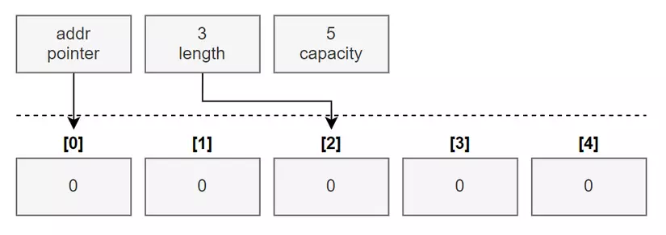

1. execute binary file -> GOOS=linux go build -o hello 
go mod init [module-path]
2. format và style guidelines -> go install golang.org/x/lint/golint@latest || after run: golint .
3. Go Type System Overview
    a. Basic Types
        - string type: khai báo var <name> string
        - boolean type: khai báo var <name> bool
        - numeric types: type sử dụng cho các biến mà lưu trữ dữ giá trị số.
            -integer: int8, uint8 (byte), int16, uint16, int32 (rune), uint32, int64, uint64, int, uint, uintptr.
            -float: float32, float64.
            -complex: complex64, complex128.
    b. Composite Types
        - pointer types: dạng pointer giống C.
        - struct types: dùng để định nghĩa cấu trúc của một đối tượng.
        - function types.
        - array types: một mảng chứa giá trị với length cố định.
        - slice type: một mảng chứa giá trị với length có thể thay đổi.
        - map types: kiểu dữ liệu key value.
        - channel types.
        - interface types: dùng để định nghĩa interface cho một đối tượng.
4.  For-each Range Loop
    for key, value := range arrays {
        statement(key)
        statement(value)
    }
5. 
